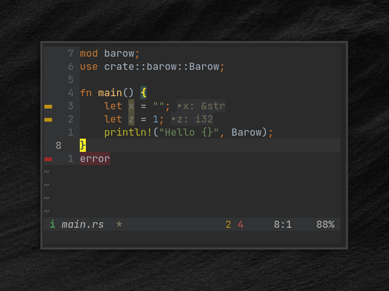

## Barow



A minimalist statusline for [n](https://neovim.io/)/[vim](https://www.vim.org/).

### install
If you use a plugin manager, follow the traditional way.

For example with [vim-plug](https://github.com/junegunn/vim-plug) add this in `.vimrc`/`init.vim`:
```
Plug 'doums/barow'
```

Then run in vim:
```
:source $MYVIMRC
:PlugInstall
```
If you use vim's native package `:h packages`.

### usage

All settings are optional.
The default configuration is as follows:

```
" in .vimrc/init.vim

let g:barow = {
      \  'modes': {
      \    'normal': [' ', 'BarowNormal'],
      \    'insert': ['i', 'BarowInsert'],
      \    'replace': ['r', 'BarowReplace'],
      \    'visual': ['v', 'BarowVisual'],
      \    'v-line': ['l', 'BarowVisual'],
      \    'v-block': ['b', 'BarowVisual'],
      \    'select': ['s', 'BarowVisual'],
      \    'command': ['c', 'BarowCommand'],
      \    'shell-ex': ['!', 'BarowCommand'],
      \    'terminal': ['t', 'BarowTerminal'],
      \    'prompt': ['p', 'BarowNormal'],
      \    'inactive': [' ', 'BarowModeNC']
      \  },
      \  'statusline': ['Barow', 'BarowNC'],
      \  'tabline': ['BarowTab', 'BarowTabSel', 'BarowTabFill'],
      \  'buf_name': {
      \    'empty': '',
      \    'hi': ['BarowBufName', 'BarowBufNameNC']
      \  },
      \  'read_only': {
      \    'value': 'ro',
      \    'hi': ['BarowRO', 'BarowRONC']
      \  },
      \  'buf_changed': {
      \    'value': '*',
      \    'hi': ['BarowChange', 'BarowChangeNC']
      \  },
      \  'tab_changed': {
      \    'value': '*',
      \    'hi': ['BarowTChange', 'BarowTChangeNC']
      \  },
      \  'line_percent': {
      \    'hi': ['BarowLPercent', 'BarowLPercentNC']
      \  },
      \  'row_col': {
      \    'hi': ['BarowRowCol', 'BarowRowColNC']
      \  },
      \  'modules': []
      \}
```
You can customize any of these values.\
For any value you want to customize provide a value with the same data structure. Otherwise barow will throw an error and exit.

For `modes`, `buf_changed` and `tab_changed` the text length is intentionally set to one character max.

The strings that start with `Barow*` are highlight groups. To change the colors you can give your own groups. Use `barow#hi` function to define your own groups.\
All `hi` keys and `statusline` key expect a list of two hi groups. First is for the statusline of the current window, second for statusline in other window.

### modules

You can add additional modules to your bar in a simple way.\
Available modules:
- [barowLSP](https://github.com/doums/barowLSP), display LSP diagnostics count and status
- [barowGit](https://github.com/doums/barowGit), display git current branch

```
" .vimrc/init.vim
" ...

Plug 'doums/barow'
Plug 'doums/barowGit'
Plug 'doums/barowLSP'
" ...

let g:barow = {
" ...
      \  'modules': [
      \    [ 'barowGit#branch', 'BarowHint' ],
      \    [ 'barowLSP#error', 'BarowError' ],
      \    [ 'barowLSP#warning', 'BarowWarning' ],
      \    [ 'barowLSP#info', 'BarowInfo' ],
      \    [ 'barowLSP#hint', 'BarowHint' ],
      \    [ 'barowLSP#coc_status', 'StatusLine' ],
      \    [ 'barowLSP#ale_status', 'StatusLine' ]
      \  ]
      \}
```

Each module is a list of two items. The first one is the function to call to get the output of the module. The second is the highlight group.\
Module outputs will only appear in the statusbar of the current window.

You can define your own module. To update the statusline call `barow#update` function.

### `barow#hi`

You can use `barow#hi` function to create your own highlight groups.
```
" arguments:   group_name,     fg_color,       bg_color,       style (optional)
call barow#hi('MyCustomGroup', ['#ffffff', 7], ['#000000', 0], 'bold')
```
For more details see `:h highlight-args`.

### `barow#update`

To update the statusline call `barow#update` function. Useful if you write a module.
```
call barow#update()
```

### color support
- Truecolor
- 256 color

### license
Mozilla Public License 2.0
